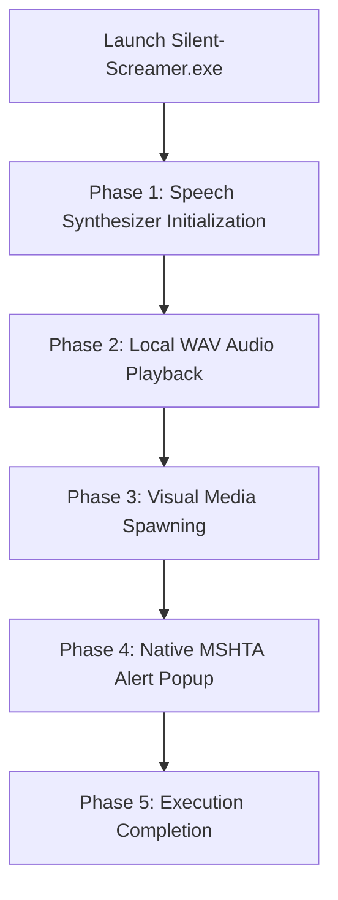

<div align="center">

# ⚡ Silent-Screamer

**An Interactive & Safe Audio-Visual Trigger Simulation for Windows Systems**

[](https://github.com/epicmajid)
[](LICENSE)
[](https://www.microsoft.com/windows)
[-FF5722?style=for-the-badge)](https://en.wikipedia.org/wiki/Executable)

<br/>

`#cybersecurity` `#windows-automation` `#batch-script` `#powershell` `#security-awareness` `#silent-screamer`

---

</div>

### 🚨 DISCLAIMER
> **FOR EDUCATIONAL, DEMONSTRATION, AND ENTERTAINMENT PURPOSES ONLY.**
>
> **Silent-Screamer** is a 100% harmless prank script designed to simulate interactive system alerts and audio triggers. **It does NOT delete, modify, exfiltrate, or damage any system files or user data.**

---

## 📌 Overview

**Silent-Screamer** is a lightweight, standalone Windows automation payload wrapped as an executable (`.exe`). Designed using native Windows command prompt execution and PowerShell automation routines, it delivers an immersive audio-visual surprise effect featuring automated speech synthesis, custom audio playback, targeted media displays, and native Windows alert dialogs.

---

## 🌟 Key Features

| Feature | Description |
| :--- | :--- |
| **📢 Text-To-Speech Output** | Native `System.Speech.Synthesis` integration delivering automated voice alerts. |
| **🔊 Synchronized WAV Playback** | Asynchronous execution of local audio assets via PowerShell `Media.SoundPlayer`. |
| **🖼️ Automated Media Trigger** | Spawns external web/image media instances directly in default system browser. |
| **💬 Native VBScript Dialogs** | Executes lightweight native popup windows via Windows `mshta` interface. |
| **📦 Portable Execution** | Bundled via Windows `IExpress` into a single standalone binary package. |
| **🔒 Safe Execution Cycle** | Safely terminates without changing persistent registry entries or core settings. |

---

## 🔄 Execution Flow



---

## 🛠️ Installation & Usage

### 📋 Prerequisites
- **Operating System:** Windows 7 / 8 / 10 / 11

### 🚀 Running the Package

1. **Clone or Download the Repository:**
   ```bash
   git clone https://github.com/epicmajid/silent-screamer.git
   ```

2. **Run the Application:**
   Double-click `Silent-Screamer.exe` (or execute `silent-screamer.bat` directly) to trigger the simulation.

---

## 🛡️ Security & AV Note

Because this package utilizes compiled Windows system calls (`mshta`, `powershell`, `cmd.exe`) inside an `IExpress` wrapper, some Antivirus / EDR engines may flag custom `.exe` wrappers as generic PUPs (Potentially Unwanted Programs).

* You can review the underlying source code or build your own package directly using the provided `.bat` file and Windows `IExpress` utility.

---

## 👤 Developer Profile

<div align="center">

| **Lead Developer** | **GitHub Profile** | **Project Repository** |
| :---: | :---: | :---: |
| **Majid** | [@epicmajid](https://github.com/epicmajid) | [silent-screamer](https://github.com/epicmajid/silent-screamer) |

</div>

---

## 🏷️ Topic Tags & Keywords

`#SilentScreamer` `#CyberSimulation` `#SecurityAwareness` `#WindowsAutomation` `#BatchScripting` `#PowerShell` `#MajidProjects`

---

## 📜 License

Distributed under the **MIT License**. See [`LICENSE`](LICENSE) for more information.

<div align="center">
  <sub>Created with ❤️ by <a href="https://github.com/epicmajid">@epicmajid</a></sub>
</div>